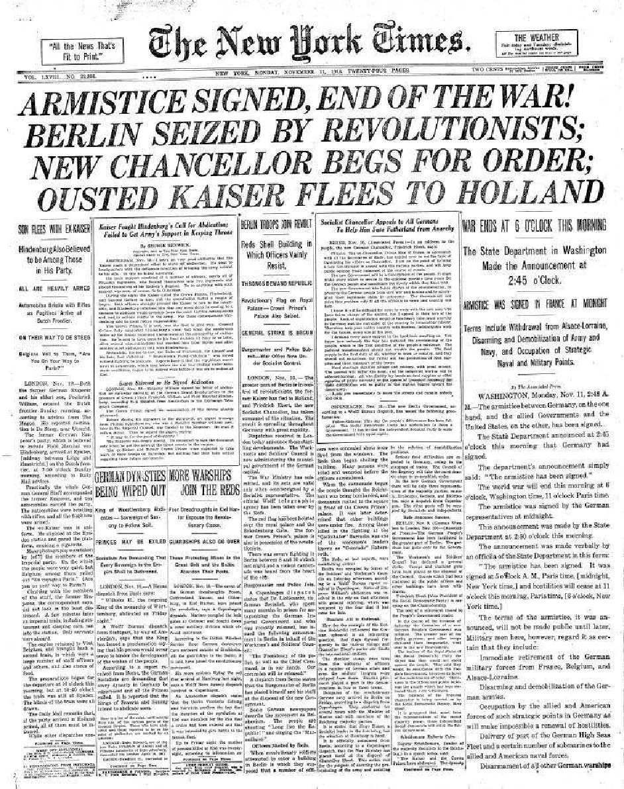
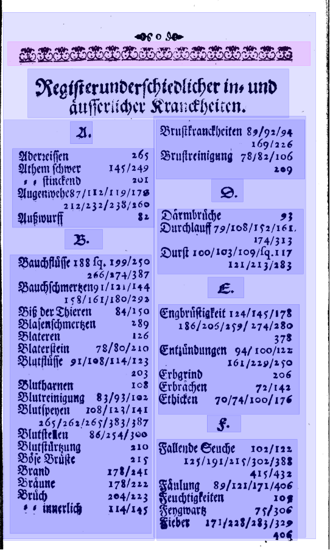
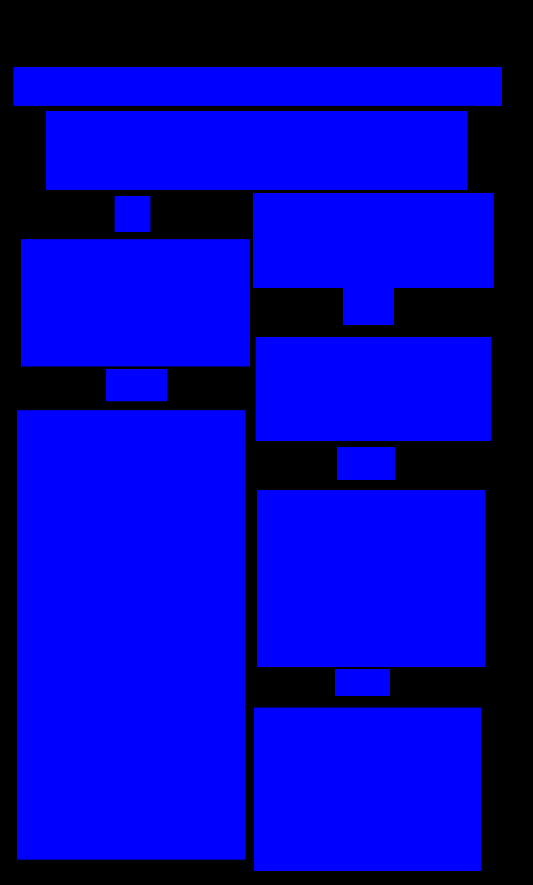

layout: true
  
<div class="my-header"></div>

<div class="my-footer">
  <table>
    <tr>
      <td style="text-align:right">Sächsische Landesbibliothek – Staats- und Universitätsbibliothek</td>
      <td>Date</td>
      <td style="text-align:right"><a href="https://www.slub-dresden.de/">www.slub-dresden.de</a></td>
    </tr>
    <tr>
      <td style="text-align:right">Referat 4.3</td>
      <td />
    </tr>
  </table>
</div>

<div class="my-title-footer">
  <table>
    <tr>
      <td style="text-align:left"><b>Kay-Michael Würzner</b></td>
    </tr>
    <tr>
      <td style="text-align:left">Referat 4.3</td>
    </tr>
    <tr>
      <td style="font-size:8pt"><b>17. Juni 2021</b></td>
    </tr>
    <tr>
      <td style="font-size:8pt">Arbeitskreis TEI Dresden</td>
    </tr>
  </table>
</div>

---

class: title-slide
count: false

# OCR mit Enthusiasmus
## Vom Bild zur TEI-Edition – selbst!

---

# Überblick

- methodische und technologische Grundlagen von OCR
- Hands-on mit Tesseract
- Training eigener OCR-Modelle

---

class: part-slide
count: false

# Was ist OCR?

---

# Was ist OCR?

.cols[
.sixty[
- Bilderfassung ≠ Texterfassung
- **O**ptical **C**haracter **R**ecognition: Automatische Erfassung von Text in Bildern
- ursprünglich begrenzt auf Zeichenerkennung
- heute häufig Synonym für den gesamten Texterfassungsprozess
  + Bildvorverarbeitung
  + Layoutanalyse (OLR)
  + Zeilenerkennung
  + ...
]
.fourty[
<center></center>
]
]

---

# Einsatzbeispiele

.cols[
.sixty[
- typische Anwendungen
  - Nummernschilderkennung
]
.fourty[
<center>

<p style="font-size:4pt;">Image by Achim Raschka, CC BY-SA 3.0</p>
</center>
]
]

---

count: false

# Einsatzbeispiele

.cols[
.sixty[
- typische Anwendungen
  - Nummernschilderkennung
  - Captcha-Umgehung
]
.fourty[
<center>

<p style="font-size:4pt;">Image by JD, CC BY-SA 2.0</p>
</center>
]
]

---

count: false

# Einsatzbeispiele

.cols[
.sixty[
- typische Anwendungen
  - Nummernschilderkennung
  - Captcha-Umgehung
  - Schlüsselinformationsextraktion
]
.fourty[
<center>

<p style="font-size:4pt;">Image by Eluminary, CC BY-SA 2.0</p>
</center>
]
]

---

count: false

# Einsatzbeispiele

.cols[
.sixty[
- typische Anwendungen
  - Nummernschilderkennung
  - Captcha-Umgehung
  - Schlüsselinformationsextraktion
  - Handschrifterkennung
]
.fourty[
<center>

</center>
]
]

---

count: false

# Einsatzbeispiele

.cols[
.sixty[
- typische Anwendungen
  - Nummernschilderkennung
  - Captcha-Umgehung
  - Schlüsselinformationsextraktion
  - Handschrifterkennung
  - Volltextdigitalisierung
]
.fourty[
<center>

<p style="font-size:4pt;">Image by Uwe Springmann, CC BY-SA 4.0</p>
</center>
]
]

---

count: false

# Einsatzbeispiele

.cols[
.sixty[
- typische Anwendungen
  - Nummernschilderkennung
  - Captcha-Umgehung
  - Schlüsselinformationsextraktion
  - Handschrifterkennung
  - Volltextdigitalisierung
]
.fourty[
<center>

<p style="font-size:4pt;">Image by Uwe Springmann, CC BY-SA 4.0</p>
</center>
]
]

---

class: part-slide
count: false

# Komponenten von OCR-Workflows

---

# Komponenten eines einfachen OCR-Workflows

.cols[
.fifty[
]
.fourty[
<p style="margin-top:-80px">

</p>
]
]

---

count: false

# Komponenten eines einfachen OCR-Workflows

.cols[
.fifty[
- Bildvorverarbeitung
]
.fourty[
<p style="margin-top:-80px">

</p>
]
]

---

count: false

# Komponenten eines einfachen OCR-Workflows

.cols[
.fifty[
- Bildvorverarbeitung
]
.fourty[
<p style="margin-top:-80px">

</p>
]
]

---

count: false

# Komponenten eines einfachen OCR-Workflows

.cols[
.fifty[
- Bildvorverarbeitung
- Layoutanalyse
]
.fourty[
<p style="margin-top:-80px">

</p>
]
]

---

count: false

# Komponenten eines einfachen OCR-Workflows

.cols[
.fifty[
- Bildvorverarbeitung
- Layoutanalyse
]
.fourty[
<p style="margin-top:-80px">

</p>
]
]

---

count: false

# Komponenten eines einfachen OCR-Workflows

.cols[
.fifty[
- Bildvorverarbeitung
- Layoutanalyse
- Texterkennung
]
.fourty[
<p style="margin-top:-80px">

</p>
]
]

---

count: false

# Komponenten eines einfachen OCR-Workflows

.cols[
.fifty[
- Bildvorverarbeitung
- Layoutanalyse
- Texterkennung
]
.fourty[
<p style="margin-top:-80px">

</p>
]
]

---

class: part-slide
count: false

# Bildvorverarbeitung


---

# Bildvorverarbeitung

- Prozesse zur bestmöglichen Vorbereitung der Digitalisate für OLR und OCR
  + **Cropping**: Beschneidung des Digitalisats auf den Druckbereich
  + **Deskewing**: Rotation des Digitalisats zur Begradigung von Schrägstellungen
  + **Binarization**: Binäre Kodierung der Pixel (bedruckte Bereiche schwarz, nicht-bedruckte Bereiche weiß)
  + **Despeckling**: Entfernung von Bildartefakten (Verschmutzungen, sichtbare Papiermaserung etc.)
  + **Dewarping**: Begradigung von Wellen auf Zeilenebene
- starker Einfluss auf Erkennungsqualität
- besondere Relevanz für historische Vorlagen

---

# Cropping

.cols[
.fifty[
<center>
<p style="margin-top:-15px">

</p>
</center>
]
.fifty[
<center>
<p style="margin-top:-15px">

</p>
</center>
]
]

---

# Deskewing

.cols[
.fifty[
<center>
<p style="margin-top:-15px">

</p>
</center>
]
.fifty[
<center>
<p style="margin-top:-15px">

</p>
</center>
]
]

---

# Binarization

.cols[
.fifty[
<center>

</center>
]
.fifty[
<center>

</center>
]
]

---

# Despeckling

.cols[
.fifty[
<center>

</center>
]
.fifty[
<center>

</center>
]
]

---

# Dewarping

<center>

</center>

---

# Einfluss *Bildvorverarbeitung*

.cols[
.fifty[
<center>

</center>
<p style="font-size:1.4rem">
Zuletzt wird anders nichts dara<span style="color:red">n</span>s/<br/>
Di<span style="color:red">r</span> <span style="color:red">z</span>acke<span style="color:red">1</span> dieser Erden <span style="color:red">r ’’</span><br/>
Die Sonne/Kind<span style="color:red">r</span>r/Fre<span style="color:red">nu</span>d’ vnd Hauß<br/>
Muß übergeben werden/ <span style="color:red">’’</span><br/>
Denn di<span style="color:red">r</span>Nat<span style="color:red">n</span>r erlässt vns<span style="color:red">’ mehr ’</span><br/>
Der stre<span style="color:red">u</span>genSch<span style="color:red">n</span>ld <span style="color:red">o</span>ndPflich<span style="color:red">r</span>.
</p>
]
.fifty[
<center>

</center>
<p style="font-size:1.4rem">
Zuletzt wird anders nichts dara<span style="color:red">n</span>s/<br/>
Die Fackel dieser Erden<br/>
Die Sonne/Kinder/Fren<span style="color:red">n</span>nd’ vnd Hauß<br/>
Muß übergeben werden/<br/>
Denn de<span style="color:red">e</span>Na<span style="color:red">in</span>r erlässt vns nicht<br/>
Der strengen Schuld vndPflicht.
</p>
]
]

---

class: part-slide
count: false

# Layoutanalyse

---

# Layoutanalyse

- Prozesse zur Erkennung der Struktur auf Seiten- und Dokumentebene (*Optical Layout Recognition*, **OLR**)
    + **Seitensegmentierung**: Lokalisierung zusammenhängender Text- und Nichttextbereiche
    + **Segmentklassifizierung**: Typisierung von Textbereichen
    + **Zeilen- bzw. Zeichentrennung**: Lokalisierung einzelner Zeilen/Zeichen
    + **Dokumentenanalyse**: Konstruktion der logischen Dokumentstruktur (METS!)
- entscheidend für die korrekte **Rekonstruktion des Textflusses** (und damit für maschinelle Auswertungen)

---

# Layoutanalyse

.cols[
.fifty[
- **strukturierende** Elemente
    + Absätze
    + Überschriften
]
.fourty[
<p style="margin-top:-20px">

</p>
]
]

---

count: false

# Layoutanalyse

.cols[
.fifty[
- **strukturierende** Elemente
    + Absätze
    + Überschriften
- **textflussunterbrechende** Elemente
    + Seitenzahlen
    + Kolumnentitel
    + Abbildungsunterschriften
    + Marginalien etc.
]
.fourty[
<p style="margin-top:-20px">

</p>
]
]

---

count: false

# Layoutanalyse

.cols[
.fifty[
- **strukturierende** Elemente
    + Absätze
    + Überschriften
- **textflussunterbrechende** Elemente
    + Seitenzahlen
    + Kolumnentitel
    + Abbildungsunterschriften
    + Marginalien etc.
- **nichttextuelle** Elemente
    + Abbildungen
    + Tabellen etc.
]
.fourty[
<p style="margin-top:-20px">

</p>
]
]

---

# Layoutanalyse: Werkzeuge

- **Missverhältnis** zwischen Forschungsergebnissen und verfügbaren Lösungen
- OCR-Programme implementieren einfache Lösungen zur Seitensegmentierung, teilweise separat adressierbar
    + Klassifizierung beschränkt sich im Wesentlichen auf Text vs. Nichttext
    + Qualität auf schwierigen Vorlagen überschaubar
- wissenschaftliche Wettbewerbe und Untersuchungen befassen sich mit der Erkennung **komplexer Layouts** und **Dokumentstukturierung**
    + elaborierte statistische Modelle (vs. Heuristiken)
    + neuronale Netze
    + **polygone** Segmente

---

# Layoutanalyse: Werkzeuge

- einzelner Befehl für Segmentierung in [`OCRopus`](https://github.com/tmbdev/ocropy) 
    + im Ergebnis nur Einzelbilder auf Zeilenebene
    + **keine Koordinaten**, kein Zugriff auf Seitensegmentierung
- Zugriff auf alle Ebenen der Seitensegmentierung in [`Tesseract`](https://github.com/tesseract-ocr/tesseract)
    + **inklusive Koordinaten**
    + basale Klassifizierung der Segmente (Spalten, Abbildungen, Formeln, Tabellen, Text)
- Layouterkennungswerkzeug `Larex` 
    + Festlegung buchspezifischer Parameter durch den Nutzer (Spalten, Kolumnentitel etc.)
    + manuelle Nachkorrektur über Benutzeroberfläche
    + kein Training möglich, keine API
- Generisches Segmentierungswerkzeug `dhSegment`
    + Layoutanalyse per **Pixelklassifizierung**

---

# *Layoutanalyse* per Pixelklassifizierung

.cols[
.fifty[
]
.fourty[
<p style="margin-top:-30px">

</p>
]
]

---

count: false

# *Layoutanalyse* per Pixelklassifizierung

.cols[
.fifty[
- Training auf manuell strukturierten Seiten
- jedes Pixel gehört in ein Segment
- jedes Pixel gehört zu einer Klasse
]
.fourty[
<p style="margin-top:-30px">

</p>
]
]

---

count: false

# *Layoutanalyse* per Pixelklassifizierung

.cols[
.fifty[
- Training auf manuell strukturierten Seiten
- jedes Pixel gehört in ein Segment
- jedes Pixel gehört zu einer Klasse
]
.fourty[
<p style="margin-top:-30px">

</p>
]
]

---

count: false

# *Layoutanalyse* per Pixelklassifizierung

.cols[
.fifty[
- Training auf manuell strukturierten Seiten
- jedes Pixel gehört in ein Segment
- jedes Pixel gehört zu einer Klasse
    + Illustration durch Farbe pro Segmenttyp
]
.fourty[
<p style="margin-top:-30px">

</p>
]
]

---

count: false

# *Layoutanalyse* per Pixelklassifizierung

.cols[
.fifty[
- Training auf manuell strukturierten Seiten
- jedes Pixel gehört in ein Segment
- jedes Pixel gehört zu einer Klasse
    + Illustration durch Farbe pro Segmenttyp
]
.fourty[
<p style="margin-top:-30px">

</p>
]
]

---

count: false

# *Layoutanalyse* per Pixelklassifizierung

.cols[
.fifty[
- Training auf manuell strukturierten Seiten
- jedes Pixel gehört in ein Segment
- jedes Pixel gehört zu einer Klasse
    + Illustration durch Farbe pro Segmenttyp
- Klassifikation der Pixel anhand ihrer **Umgebung** (i.e. Farbe im Original)
]
.fourty[
<p style="margin-top:-30px">

</p>
]
]

---

count: false

# *Layoutanalyse* per Pixelklassifizierung

.cols[
.fifty[
- Training auf manuell strukturierten Seiten
- jedes Pixel gehört in ein Segment
- jedes Pixel gehört zu einer Klasse
    + Illustration durch Farbe pro Segmenttyp
- Klassifikation der Pixel anhand ihrer Umgebung (i.e. Farbe im Original)
    + beliebig komplexe Schemata möglich
        * Text vs. Nichttext
]
.fourty[
<p style="margin-top:-30px">

</p>
]
]

---

count: false

# *Layoutanalyse* per Pixelklassifizierung

.cols[
.fifty[
- Training auf manuell strukturierten Seiten
- jedes Pixel gehört in ein Segment
- jedes Pixel gehört zu einer Klasse
  + Illustration durch Farbe pro Segmenttyp
- Klassifikation der Pixel anhand ihrer Umgebung (i.e. Farbe im Original)
  + beliebig komplexe Schemata möglich
      * Text vs. Nichttext
]
.fourty[
<p style="margin-top:-30px">

</p>
]
]

---

class: part-slide
count: false

# Texterkennung

---

# Texterkennung: Zeichenorientierte Ansätze

.cols[
.seventy[
- Erkennung erfolgt *glyphenweise*
  - **Mustervergleich**: Vergleich der Zeichenbilder zu in einem „Setzkasten“ gespeicherten Glyphen **Pixel für Pixel**
  - **Merkmalsvergleich**: Zerlegung der Glyphen in vordefinierte, bedeutungstragende **Eigenschaften** wie *Einfärbung*, *Kurven*, *Linien* etc. und Vergleich zu Referenzmaterialien
- Kombination beider Ansätze!
- Zerlegung der Seite in *Zeilen* und *Zeichen* notwendig
- Vorgehen in `ABBYY FineReader`
]
.fourty[
<center></center>
]
]

---

# Texterkennung: Zeilenorientierte Ansätze

- Erkennung erfolgt *zeilenweise*
  1. **Skalierung:** einheitliche Höhe für alle Zeilen
  2. **Merkmalsextraktion**: Raster mit festgelegter Anzahl (horizontaler) Zeilen und variabler Anzahl (vertikaler) Spalten → Zeilen als Sequenzen binärwertiger Vektoren fixer Länge
<center></center>
- kontextsensitive Erkennung über *Übergangswahrscheinlichkeiten* der Vektoren
- Zerlegung der Seite in *Zeilen* notwendig
- Vorgehen *robuster* gegenüber Varianz durch Artefakte als zeichenorientierte Ansätze
- `Tesseract` (ab Version 4), `OCRopus`, `kraken`, `Calamari`
  + Einsatz *neuronaler Netze* für die Sequenzklassifikation

---

# Texterkennung

- Ziel: Transformation von Bilddaten in maschinenlesbaren Volltext
    + schrittweise Verarbeitung

<center>

</center>
<center>
<p>↓</p>
</center>
<center>
<p style="display: inline-block; text-align: left; font-size: 16pt.; font-style: italic;">
oberwähntem Tage mancher sorgliche Gedanke auf,<br/>
&amp; wir seufzten öfters zum Heiland, daß Er uns<br/>
vor allem Schaden, der uns etwa in der folgen-<br/>
den Nacht begegnen könnte, in Gnaden bewahren
</p>
</center>

---

# Texterkennung

- Schritt 1: Zeilenerkennung
    + **regelbasierte** (Bildmorphologie) oder
    + **datengetriebene** Verfahren (e.g. Pixelklassifikation)

<center>

</center>
<center>
<p>↓</p>
</center>
<center>

</center>

---

# Texterkennung

- Schritt 2: Vektorisierung
    + **Skalierung** auf einheitliche Höhe
    + **Unterteilung** in 1pixel-breite Streifen

<center>

</center>
<center>
<p>↓</p>
</center>
<center>

</center>

---

# Texterkennung

- Schritt 3: Textermittlung
    + **Übergangswahrscheinlichkeiten** zwischen Vektoren
    + Rückgriff auf (offline) trainiertes **Modell**

<center>

</center>
<center>
<p>↓</p>
</center>
<center>
<p style="display: inline-block; text-align: left; font-size: 16pt.; font-style: italic;">
oberwähntem Tage mancher sorgliche Gedanke auf,<br/>
&amp; wir seufzten öfters zum Heiland, daß Er uns<br/>
vor allem Schaden, der uns etwa in der folgen-<br/>
den Nacht begegnen könnte, in Gnaden bewahren
</p>
</center>

---

# Texterkennung

.cols[
.fourty[
- Schritt 3: Zeichenerkennung (Prinzip)
    + Erkennung auf Zeilenebene
    + Ausgabe der Zeichen mit höchster Wahrscheinlichkeit
]
.sixty[
<p style="margin-top:-20px">

</p>
]
]

---

# Texterkennung

- Software
    + [**Tesseract**](https://github.com/tesseract-ocr/tesseract): komplettes Open-Source-Paket
        * regelbasierte Bildvorverarbeitung und Layouterkennung
        * datengetriebene Texterkennung (unterstützt > 100 Sprachen)
        * Ease-of-Use-Training eigener Modelle
        * für OCR und **HTR** verwendbar
    + [**OCRopy**](https://github.com/ocropus/ocropy): umfangreiches Open-Source-Paket
        * regelbasierte Bildvorverarbeitung und Layouterkennung
        * datengetriebene Texterkennung (nur sehr wenige Modelle vorhanden)
        * für OCR und **HTR** verwendbar
        * prominente Ableger: [**kraken**](https://kraken.re) und [**Calamari**](https://github.com/Calamari-OCR/calamari)
    + [**OCR-D**](https://ocr-d.de/): Workflow-Engine
        * Orchestrierung verschiedener Open-Source-Pakete zu stabilen Workflows
        * gleichzeitig DFG-Förderprogramm zur Verbesserung von OCR für historische Drucke
        * SLUB als maßgebliche Entwicklungseinrichtung

---

class: part-slide
count: false

# Tesseract

---

# Tesseract

- mit großem Abstand: verbreitetste OCR-Software
    + Einsatz in unzähligen Apps, Forschungsprojekten, privaten Kontexten
- kostenlos verwendbar, quelloffen entwickelt
<center></center>
- Lizenzmodell erlaubt kommerziellen Einsatz
    + (Teil-)Grund für Erfolg?

---

# Exkurs – OpenSource?

- OpenSource ist nicht gleich OpenSource!
    + quelloffene Software vs.
        * öffentlich geförderte Projekte ↦ öffentlich verfügbare Projektergebnisse
        * häufig bloßes „Abkippen“ auf GitHub
    + Philosophie der offenen Entwicklung
        * öffentlich von Anfang an
        * Anschluss an vorhandene Communities
        * Fehlermeldung und Funktionalitätsfeedback während der Laufzeit
        * Weiterentwicklung und Pflege auch nach Ablauf der Förderung
- „Kulturrevolution“: **Reproducible Science**
    + Daten (Texte etc.) veröffentlicht unter CC
    + Methoden veröffentlicht als quelloffene Software
    + wissenschaftliche Dokumentation veröffentlicht als *Open Access*

---

# Tesseract – Geschichte

- **1985 bis 1994**: Entwicklung bei Hewlett Packard (hauptsächlich von Ray Smith)
- **1998**: C++-Port
- **2005**: Open-Source-Veröffentlichung
- **2006 bis 2017**: Weiterentwicklung gefördert von Google
- **2008**: Migration nach GitHub
- **2016**: Umstieg auf neuronale Netze als primäre Datenstruktur für Texterkennung
- **2018**: Weiterentwicklung vollständig auf den Schultern der Nutzergemeinde

---

# Tesseract – Funktionsumfang

.cols[
.sixty[
- Texterkennung ⊂ OCR
]
.fourty[
<center>
</center>
]
]

---

count: false

# Tesseract – Funktionsumfang

.cols[
.sixty[
- Texterkennung ⊂ OCR
    + Bildoptimierung
]
.fourty[
<center>
</center>
]
]

---

count: false

# Tesseract – Funktionsumfang

.cols[
.sixty[
- Texterkennung ⊂ OCR
    + Bildoptimierung
        * Beschneidung auf Druckbereich
]
.fourty[
<center>
</center>
]
]

---

count: false

# Tesseract – Funktionsumfang

.cols[
.sixty[
- Texterkennung ⊂ OCR
    + Bildoptimierung
        * Beschneidung auf Druckbereich
]
.fourty[
<center>

</center>
]
]

---

count: false

# Tesseract – Funktionsumfang

.cols[
.sixty[
- Texterkennung ⊂ OCR
    + Bildoptimierung
        * Beschneidung auf Druckbereich
]
.fourty[
<center>

</center>
]
]

---

count: false

# Tesseract – Funktionsumfang

.cols[
.sixty[
- Texterkennung ⊂ OCR
    + Bildoptimierung
        * Beschneidung auf Druckbereich
        * Binarisierung
]
.fourty[
<center>

</center>
]
]

---

count: false

# Tesseract – Funktionsumfang

.cols[
.sixty[
- Texterkennung ⊂ OCR
    + Bildoptimierung
        * Beschneidung auf Druckbereich
        * Binarisierung
]
.fourty[
<center>

</center>
]
]

---

count: false

# Tesseract – Funktionsumfang

.cols[
.sixty[
- Texterkennung ⊂ OCR
    + Bildoptimierung
        * Beschneidung auf Druckbereich
        * Binarisierung
]
.fourty[
<center>

</center>
]
]

---

count: false

# Tesseract – Funktionsumfang

.cols[
.sixty[
- Texterkennung ⊂ OCR
    + Bildoptimierung
        * Beschneidung auf Druckbereich
        * Binarisierung
        * Begradigung
]
.fourty[
<center>

</center>
]
]

---

count: false

# Tesseract – Funktionsumfang

.cols[
.sixty[
- Texterkennung ⊂ OCR
    + Bildoptimierung
        * Beschneidung auf Druckbereich
        * Binarisierung
        * Begradigung
]
.fourty[
<center>

</center>
]
]

---

count: false

# Tesseract – Funktionsumfang

.cols[
.sixty[
- Texterkennung ⊂ OCR
    + Bildoptimierung
        * Beschneidung auf Druckbereich
        * Binarisierung
        * Begradigung
]
.fourty[
<center>

</center>
]
]

---

count: false

# Tesseract – Funktionsumfang

.cols[
.sixty[
- Texterkennung ⊂ OCR
    + Bildoptimierung
        * Beschneidung auf Druckbereich
        * Binarisierung
        * Begradigung
        * ...
]
.fourty[
<center>

</center>
]
]

---

count: false

# Tesseract – Funktionsumfang

.cols[
.sixty[
- Texterkennung ⊂ OCR
    + Bildoptimierung
        * Beschneidung auf Druckbereich
        * Binarisierung
        * Begradigung
        * ...
    + Layoutanalyse
]
.fourty[
<center>

</center>
]
]

---

count: false

# Tesseract – Funktionsumfang

.cols[
.sixty[
- Texterkennung ⊂ OCR
    + Bildoptimierung
        * Beschneidung auf Druckbereich
        * Binarisierung
        * Begradigung
        * ...
    + Layoutanalyse
        * Seitensegmentierung
]
.fourty[
<center>

</center>
]
]

---

count: false

# Tesseract – Funktionsumfang

.cols[
.sixty[
- Texterkennung ⊂ OCR
    + Bildoptimierung
        * Beschneidung auf Druckbereich
        * Binarisierung
        * Begradigung
        * ...
    + Layoutanalyse
        * Seitensegmentierung
]
.fourty[
<center>

</center>
]
]

---

count: false

# Tesseract – Funktionsumfang

.cols[
.sixty[
- Texterkennung ⊂ OCR
    + Bildoptimierung
        * Beschneidung auf Druckbereich
        * Binarisierung
        * Begradigung
        * ...
    + Layoutanalyse
        * Seitensegmentierung
]
.fourty[
<center>

</center>
]
]

---

count: false

# Tesseract – Funktionsumfang

.cols[
.sixty[
- Texterkennung ⊂ OCR
    + Bildoptimierung
        * Beschneidung auf Druckbereich
        * Binarisierung
        * Begradigung
        * ...
    + Layoutanalyse
        * Seitensegmentierung
        * Segmentklassifizierung
]
.fourty[
<center>

</center>
]
]

---

count: false

# Tesseract – Funktionsumfang

.cols[
.sixty[
- Texterkennung ⊂ OCR
    + Bildoptimierung
        * Beschneidung auf Druckbereich
        * Binarisierung
        * Begradigung
        * ...
    + Layoutanalyse
        * Seitensegmentierung
        * Segmentklassifizierung
]
.fourty[
<center>

</center>
]
]

---

count: false

# Tesseract – Funktionsumfang

.cols[
.sixty[
- Texterkennung ⊂ OCR
    + Bildoptimierung
        * Beschneidung auf Druckbereich
        * Binarisierung
        * Begradigung
        * ...
    + Layoutanalyse
        * Seitensegmentierung
        * Segmentklassifizierung
]
.fourty[
<center>

</center>
]
]

---

count: false

# Tesseract – Funktionsumfang

.cols[
.sixty[
- Texterkennung ⊂ OCR
    + Bildoptimierung
        * Beschneidung auf Druckbereich
        * Binarisierung
        * Begradigung
        * ...
    + Layoutanalyse
        * Seitensegmentierung
        * Segmentklassifizierung
        * Zeilenerkennung
]
.fourty[
<center>

</center>
]
]

---

count: false

# Tesseract – Funktionsumfang

.cols[
.sixty[
- Texterkennung ⊂ OCR
    + Bildoptimierung
        * Beschneidung auf Druckbereich
        * Binarisierung
        * Begradigung
        * ...
    + Layoutanalyse
        * Seitensegmentierung
        * Segmentklassifizierung
        * Zeilenerkennung
]
.fourty[
<center>

</center>
]
]

---

count: false

# Tesseract – Funktionsumfang

.cols[
.sixty[
- Texterkennung ⊂ OCR
    + Bildoptimierung
        * Beschneidung auf Druckbereich
        * Binarisierung
        * Begradigung
        * ...
    + Layoutanalyse
        * Seitensegmentierung
        * Segmentklassifizierung
        * Zeilenerkennung
]
.fourty[
<center>

</center>
]
]

---

count: false

# Tesseract – Funktionsumfang

.cols[
.sixty[
- Texterkennung ⊂ OCR
    + Bildoptimierung
        * Beschneidung auf Druckbereich
        * Binarisierung
        * Begradigung
        * ...
    + Layoutanalyse
        * Seitensegmentierung
        * Segmentklassifizierung
        * Zeilenerkennung
    + Texterkennung
]
.fourty[
<center>

</center>
]
]

---

count: false

# Tesseract – Funktionsumfang

.cols[
.sixty[
- Texterkennung ⊂ OCR
    + Bildoptimierung
        * Beschneidung auf Druckbereich
        * Binarisierung
        * Begradigung
        * ...
    + Layoutanalyse
        * Seitensegmentierung
        * Segmentklassifizierung
        * Zeilenerkennung
    + Texterkennung
        * multiple Sprachen/Schriften
]
.fourty[
<center>

</center>
]
]

---

count: false

# Tesseract – Funktionsumfang

.cols[
.sixty[
- Texterkennung ⊂ OCR
    + Bildoptimierung
        * Beschneidung auf Druckbereich
        * Binarisierung
        * Begradigung
        * ...
    + Layoutanalyse
        * Seitensegmentierung
        * Segmentklassifizierung
        * Zeilenerkennung
    + Texterkennung
        * multiple Sprachen/Schriften
        * Wortlisten
]
.fourty[
<center>

</center>
]
]

---

count: false

# Tesseract – Funktionsumfang

.cols[
.sixty[
- Texterkennung ⊂ OCR
    + Bildoptimierung
        * Beschneidung auf Druckbereich
        * Binarisierung
        * Begradigung
        * ...
    + Layoutanalyse
        * Seitensegmentierung
        * Segmentklassifizierung
        * Zeilenerkennung
    + Texterkennung
        * multiple Sprachen/Schriften
        * Wortlisten
        * spezielle Zahlen- und Sonderzeichenbehandlung
]
.fourty[
<center>

</center>
]
]

---

class: part-slide
count: false

# Hands-on

---

# Hands-on

- Teil praktisch aller **Linux**distributionen
    + Installation auf MacOS per `Homebrew` und `MacPorts` möglich
    + Installation unter Windows per [Installer](https://github.com/UB-Mannheim/tesseract/wiki) möglich
- Zugriff auf Tesseract per
    + Programmierschnittstelle (API)
    + **Kommandozeilenschnittstelle** (CLI)
    + graphische Benutzeroberfläche (GUI, Drittanbieter)
- Erkennunsgmodelle für zahlreiche Sprachen bzw. Schriften vorhanden
    + teilweise als installierbare Pakete
    + empfehlenswert jedoch Download von [GitHub](https://github.com/tesseract-ocr/tessdata_best)

---

# Hands-on – Installation

Cf. [https://github.com/tesseract-ocr/tesseract/wiki](https://github.com/tesseract-ocr/tesseract/wiki#installation)

```shell
$ tesseract --help
Usage:
  tesseract --help | --help-extra | --version
  tesseract --list-langs
  tesseract imagename outputbase [options...] [configfile...]

OCR options:
  -l LANG[+LANG]        Specify language(s) used for OCR.
NOTE: These options must occur before any configfile.

Single options:
  --help                Show this help message.
  --help-extra          Show extra help for advanced users.
  --version             Show version information.
  --list-langs          List available languages for tesseract engine.
```

---

# Hands-on – Anwendung

- Prinzipielle Kommandostruktur
```
tesseract EINGABEBILD AUSGABE (OPTIONEN) (AUSGABEKONFIGURATION)
```
- einfachster Aufruf
```
$ tesseract sample.png -
```
    + `-` schickt die Ergebnisse nach `stdout`
    + Modell `eng` per default ausgewählt
    + Konfiguration `txt` per default ausgewählt

.cols[
.sixty[
```
The Quick Brown
Fox Jumps Over
The Lazy Dog
```
]
.fourty[
<center>

<p style="font-size:4pt;">Image by Peter J. Acklam, public domain</p>
</center>
]
]

---

# Hands-on – Optionen

- Modellauswahl
    + Option `-l MODELLNAME`, Datei `MODELLNAME.traineddata` nötig
    + eventuell in Kombination mit `--tessdata-dir`
    + Kombination mehrerer Modelle möglich:
      `-l MODELLNAME+MODELLNAME2+MODELLNAME3`
- Segmentierung
    + Option `-psm MODUS` (Liste verfügbarer Optionen via `--help-psm`)
    + Möglichkeit einzelne Absätze, Zeilen oder gar Wörter zu verarbeiten
- Bildauflösung
    + wichtiger Faktor für Ergebnisqualität
    + idealerweise min. 300 dpi
    + unter Umständen Teil der Metadaten, anonsten: `Warning: Invalid resolution 0 dpi. Using 70 instead.`
    + manuell per `--dpi` setzbar

---

# Hands-on – Konfigurationen

- nur wenige Einstellungen als CLI-Optionen verfügbar
- feingranulare Anpassungsmöglichkeiten per Konfigurationsdatei
- per default unter `/usr/share/tessdata/configs`
    + `txt`: Rohtext (default)
    + `alto`: ALTO-XML
    + `hocr`: hOCR (HTML-artig)
    + **`pdf`**: PDF
    + ...

---

# Hands-on – Helferlein

- **Kommandozeile**
    + wichtigeste Voraussetzung für „das nächste Level“
    + Linux: `bash`, `zsh`; MacOS: `terminal`; Windows: `cmd`
- `ImageMagick`: [imagemagick.org](https://imagemagick.org/script/download.php#windows)
    + Bildbearbeitungs- und **-konvertierungsprogramm**
    + einfache Anwendung auf der Kommandozeile
- `QPDF`: [qpdf.sourceforge.net](http://qpdf.sourceforge.net/)
    + PDF-Bearbeitung auf der Kommandozeile
    + insb. **Aufteilen** und **Zusammenführen**

---

# Hands-on – Walkthrough

<a href="https://digital.slub-dresden.de/data/kitodo/DresPh_880545186-1993030301_01-a/DresPh_880545186-1993030301_01-a_tif/jpegs/DresPh_880545186-1993030301_01-a.pdf">Beispiel-PDF</a> (ohne Text)
1. Auftrennung in Einzelseiten
```
$ qpdf DresPh_880545186-1993030301_01-a.pdf --split-pages DresPh.pdf
```
2. Konvertierung in Bilddateien
```
$  for i in `find . -name "Dres*.pdf"`; do convert $i $i.tif; done
```
3. OCR
```
$ for i in `find . -name "Dres*.pdf.tif"`; do tesseract $i $i \
    -l jpn+Japanese+deu+Latin pdf; done
```
4. Zusammenführung der Einzel-PDFs
```
qpdf --empty --pages DresPh-0[0-9].pdf.tif.pdf -- DresPh.pdf
```

---

class: part-slide
count: false

# Tipps und Tricks

---

# Tipps und Tricks

- Primärer Fokus von Tesseract: Texterkennung
    + kaum (Weiter-)Entwicklung im Bereich Bildvorverarbeitung und Layouanalyse
    + Verbesserung der Erkennungsgüte durch externe, ggf. manuelle Optimierung möglich!
    + `Scantailor`: Programm zur (semi-)automatischen Bildoptimierung für OCR
    + `olena`: umfangreiche Bibliothek zur Dokumentenverarbeitung
        * enthält mehrere Binarisierungsverfahren
        * (Tesseract-eigene Binarisierung ist sehr schlecht)
.cols[
.fifty[
<center>

</center>
]
.fifty[
<center>

</center>
]
]
---

count: false

# Tipps und Tricks

- Primärer Fokus von Tesseract: Texterkennung
    + kaum (Weiter-)Entwicklung im Bereich Bildvorverarbeitung und Layouanalyse
    + Verbesserung der Erkennungsgüte durch externe, ggf. manuelle Optimierung möglich!
    + `Scantailor`: Programm zur (semi-)automatischen Bildoptimierung für OCR
    + `olena`: umfangreiche Bibliothek zur Dokumentenverarbeitung
        * enthält mehrere Binarisierungsverfahren
        * (Tesseract-eigene Binarisierung ist sehr schlecht)
.cols[
.fifty[
<p style="font-size:1.1rem">
Zuletzt wird anders nichts dara<span style="color:red">n</span>s/<br/>
Di<span style="color:red">r</span> <span style="color:red">z</span>acke<span style="color:red">1</span> dieser Erden <span style="color:red">r ’’</span><br/>
Die Sonne/Kind<span style="color:red">r</span>r/Fre<span style="color:red">nu</span>d’ vnd Hauß<br/>
Muß übergeben werden/ <span style="color:red">’’</span><br/>
Denn di<span style="color:red">r</span>Nat<span style="color:red">n</span>r erlässt vns<span style="color:red">’ mehr ’</span><br/>
Der stre<span style="color:red">u</span>genSch<span style="color:red">n</span>ld <span style="color:red">o</span>ndPflich<span style="color:red">r</span>.
</p>
]
.fifty[
<p style="font-size:1.1rem">
Zuletzt wird anders nichts dara<span style="color:red">n</span>s/<br/>
Die Fackel dieser Erden<br/>
Die Sonne/Kinder/Fren<span style="color:red">n</span>nd’ vnd Hauß<br/>
Muß übergeben werden/<br/>
Denn de<span style="color:red">e</span>Na<span style="color:red">in</span>r erlässt vns nicht<br/>
Der strengen Schuld vndPflicht.
</p>
]
]

---

# Tipps und Tricks

- Modelle *synthetisch* und auf modernen Texten trainiert
    * Texterkennung basiert auf statistischen Modellen über Binärvektoren.
    * Wahrscheinlichkeitsverteilungen werden „gelernt“.
    * Trainingsdaten: Bild-Text-Paare von Zeilen
        + Abschreiben von Büchern ist aufwendig!
        + Alternative: Daten mit Hilfe von Texten und Computerschriften automatisch erzeugen
        + für historische Daten unter Umständen nicht adäquat
    * Trainieren kann jeder!

---

class: part-slide

# Many thanks for your attention!

<center>
<a href="https://wrznr.github.io/slide-template/">wrznr.github.io/slide-template</a>
</center>
